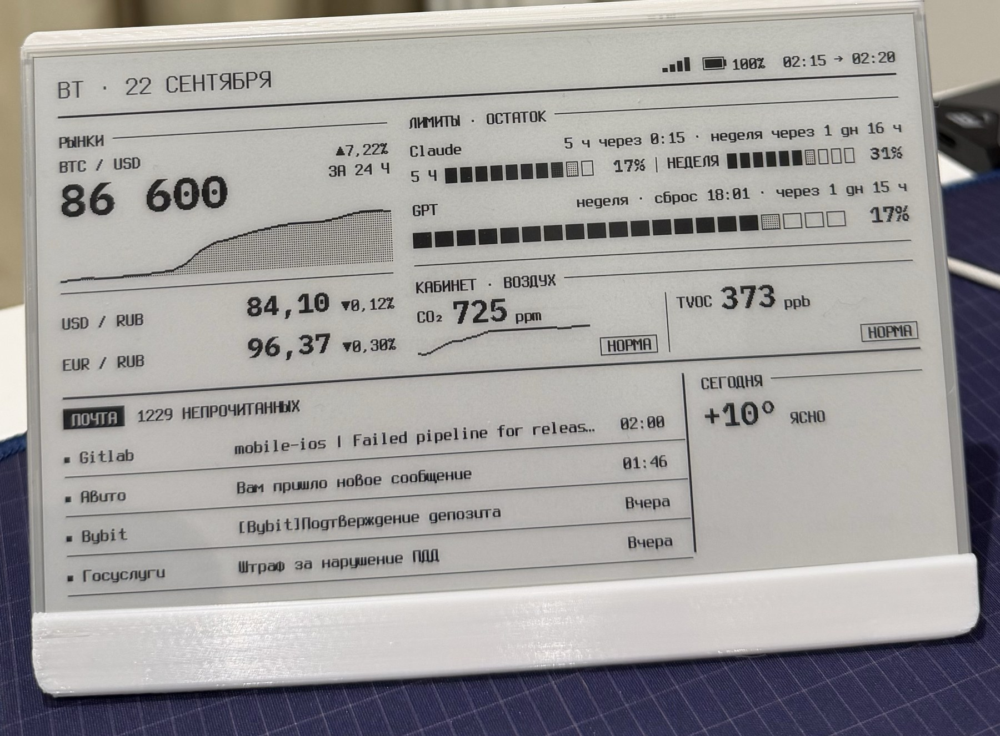
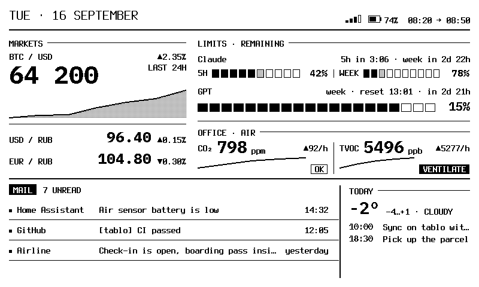
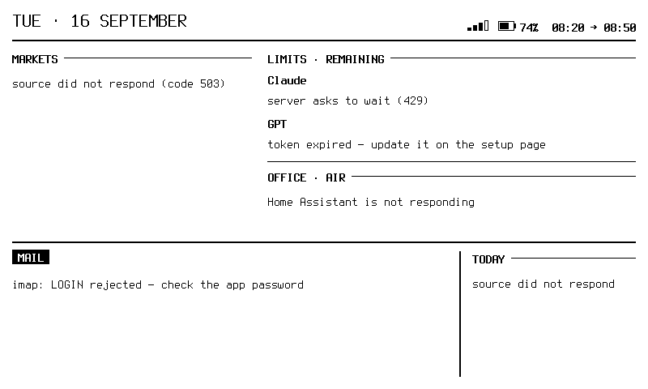
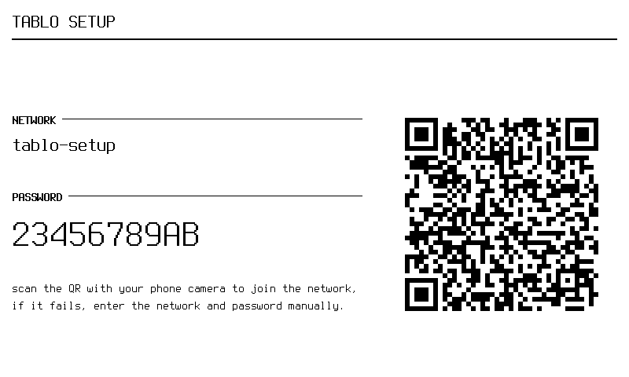

<p align="center">
  
</p>

<h1 align="center">tablo</h1>

<p align="center">
  Self-contained e-ink dashboard firmware for the TRMNL 7.5" DIY kit (ESP32-S3).<br>
  Crypto and forex rates, Claude Code and Codex usage limits, air quality, unread mail, weather. No server required.
</p>

<p align="center">
  <a href="https://github.com/pavellunev/tablo/actions/workflows/ci.yml"></a>
  <a href="https://github.com/pavellunev/tablo/releases"></a>
  <a href="LICENSE"></a>
</p>

<p align="center">
  English · <a href="README.ru.md">Русский</a>
</p>

## Features

- **Standalone.** The ESP32 fetches data straight from Binance, the Central Bank of Russia, Anthropic, OpenAI, Open-Meteo, Home Assistant and your IMAP mailbox, then renders the frame itself. No home server, no cloud relay, no companion app.
- **Claude Code and Codex limits on your desk.** Remaining 5-hour and weekly windows, time to reset. OAuth tokens are refreshed on the device.
- **Honest display.** Stale values are marked, a failed source shows the reason instead of disappearing, zero is never drawn in place of "no data".
- **Three dashboards** switched with the on-board buttons, composed from widgets on the setup page.
- **Phone setup.** Access point with a QR code on first boot, then a web page on your home network. UI in English or Russian.
- **E-ink friendly.** Partial refresh only when something changed, full refresh once an hour.
- **Prebuilt firmware** in [Releases](https://github.com/pavellunev/tablo/releases), host-side tests and frame rendering without hardware.

## What's on the screen

<p align="center">
  
</p>

| Block | Shows | Source |
|---|---|---|
| **Markets** | BTC with a 24-hour chart, USD and EUR rates with daily change | Binance, Central Bank of Russia |
| **Limits** | Remaining Claude 5-hour and weekly windows, Codex weekly window, time to reset | Anthropic and OpenAI OAuth usage endpoints |
| **Air** | CO₂ and TVOC with a 6-hour chart and a "fresh / ok / ventilate" state | Home Assistant |
| **Mail** | Unread count and the last four messages | IMAP |
| **Today** | Temperature and weather summary for your city | Open-Meteo, geocoding and time zone resolved automatically |

When sources fail, every block stays on screen and explains why:

<p align="center">
  
</p>

## Hardware

[Seeed Studio TRMNL 7.5" OG DIY Kit](https://www.seeedstudio.com/TRMNL-7-5-Inch-OG-DIY-Kit-p-6481.html):
XIAO ESP32-S3 (8 MB flash, 8 MB PSRAM), 7.5" 800×480 monochrome e-paper, three buttons, battery with charge measurement.
The stand in the photo is an [L-shaped case from MakerWorld](https://makerworld.com/en/models/1625065-trmnl-7-5-og-diy-kit-l-shape).

## Install

### Prebuilt firmware

Download `tablo-<version>-full.bin` from [Releases](https://github.com/pavellunev/tablo/releases) and flash it at address `0x0`:

```bash
pip install esptool
esptool.py --chip esp32s3 --port /dev/ttyACM0 write_flash 0x0 tablo-<version>-full.bin
```

Without a command line: open [web.esphome.io](https://web.esphome.io) in Chrome, connect the board over USB and pick the same file.

### Build from source

Requires [PlatformIO](https://platformio.org/) and Python 3.

```bash
pio run                    # build
pio run -t upload          # flash firmware
pio run -t uploadfs        # flash the setup page
./scripts/verify.sh        # build + host-side tests
```

`firmware/src/secrets.h` is optional. Copy it from `secrets.h.example` if you want Wi-Fi and tokens baked into the image; otherwise enter everything on the setup page.

## Setup

**First boot.** With no known network the device starts an access point named `tablo-setup` and shows its password and a QR code. Point your phone camera at the code, the setup page opens.

<p align="center">
  
</p>

**Later.** On your home network the page is at `http://tablo-setup.local/` (the device name can be changed there). Sources are configured as cards: Claude, Codex, mail, Home Assistant, rates, weather and city. Secrets are entered once and never shown again. Hold button 1 for three seconds to force the access point.

**Credentials.**

| Source | What to enter | Where to get it |
|---|---|---|
| Claude | OAuth access + refresh token | Claude Code login: `~/.claude/.credentials.json` (macOS: Keychain item "Claude Code-credentials") |
| Codex | OAuth access + refresh token | Codex CLI login: `~/.codex/auth.json` |
| Mail | IMAP server, address, app password | Your provider's app passwords (Gmail: Security → App passwords) |
| Home Assistant | URL, long-lived access token | HA profile → Security → Long-lived access tokens |
| Rates, weather | nothing | public APIs |

Anthropic and OpenAI usage endpoints are not reachable from every region. The device reports this on screen instead of showing zeros.

## Dashboards and widgets

Three dashboards are switched with buttons 1–3. Each is built on the setup page from a widget palette with a live preview.

| Size | Width | Meaning |
|---|---|---|
| `S` | 202 px | narrow column, like Today |
| `M` | 296 px | medium, like Markets |
| `flex` | remaining | shares the rest of the row with other flex widgets |

A hidden widget leaves no gap, its neighbours take the space. Built-in widgets: markets, limits, air, limits + air, mail, today, metric (any slot, large) and caption.

Adding a widget is one file plus a registry entry. Widgets declare which data slots they need and how often, and the device polls a source only when some visible widget needs it. See [docs/widgets.md](docs/widgets.md).

## Development

```
sources ──► connectors ──► slots ──► widgets ──► 800×480 frame
Binance,    HTTP/JSON,     btc,      markets,    1-bit canvas,
Anthropic,  OAuth refresh, limit.*,  limits,     Terminus +
OpenAI,     IMAP dialog,   co2,      air, mail,  IBM Plex Mono,
Open-Meteo, parsing        mail.*    today, …    partial refresh
```

- `scripts/verify.sh` builds the firmware and runs host-side tests (slots, config, layout, polling schedule, buttons). `--fast` skips tests.
- `tools/render_frame/build_and_run.sh` renders every screen to PNG with the same layout code that runs on the panel: three dashboards, boot and access point screens, failure scenarios.
- `tools/compare_frame.py` checks the frame skeleton against the reference mockup.
- CI runs the same build and tests on every push. A `v*` tag publishes a release with `full`, `firmware` and `littlefs` images.

Documentation (Russian for now):

- [docs/decisions.md](docs/decisions.md) — design decisions and their cost: on-device rendering, OAuth and IMAP without a relay, setup from any network, HTTPS with pinned roots.
- [docs/architecture.md](docs/architecture.md) — slots, connectors, layout.
- [docs/widgets.md](docs/widgets.md) — how to add a widget.
- [docs/constructor.md](docs/constructor.md) — dashboards, palette, source wizard.

## License

MIT. Fonts Terminus and IBM Plex Mono are under SIL OFL 1.1, see `firmware/assets/`.
