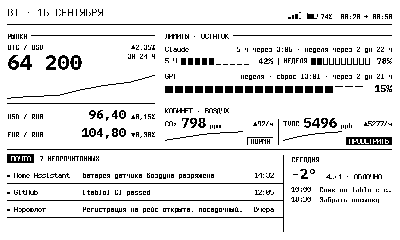
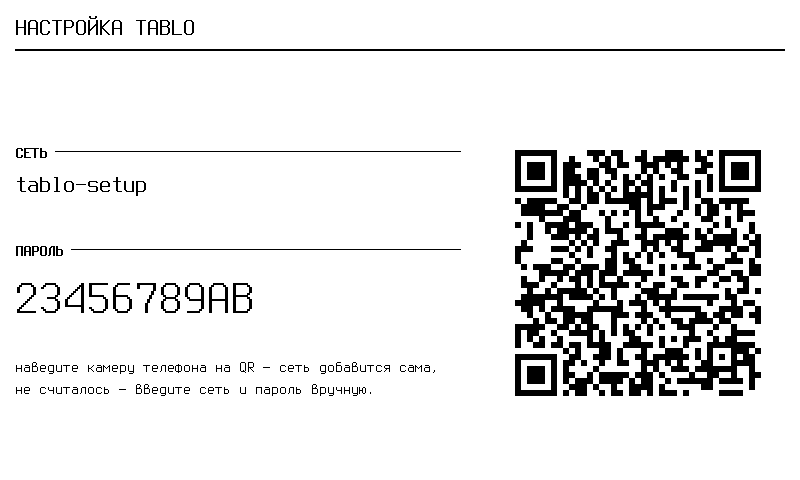

<p align="center">
  
</p>

<h1 align="center">tablo</h1>

<p align="center">
  Автономный e-ink дашборд, который работает там, куда его привезли.<br>
  Сам ходит за данными, сам рисует кадр, настраивается с телефона.
</p>

<p align="center">
  <a href="#идея">Идея</a> ·
  <a href="#что-на-экране">Что на экране</a> ·
  <a href="#как-это-устроено">Как устроено</a> ·
  <a href="#быстрый-старт">Быстрый старт</a> ·
  <a href="#конструктор">Конструктор</a> ·
  <a href="docs/decisions.md">Решения</a>
</p>

---

- **Автономный.** Курсы, погода, лимиты Claude и Codex по OAuth, почта по IMAP — устройство берёт всё само, без сервера-посредника.
- **Честный экран.** Устаревшее помечено, ноль не подменяет отсутствие, отказавший источник объясняет причину.
- **Три экрана** переключаются кнопками на плате и собираются из виджетов на странице настройки.
- **Настройка с телефона.** Точка доступа с QR при первом включении, дальше — страница в домашней сети.
- **Бережно к e-ink.** Частичное обновление только при изменениях, полное — раз в час.

## Идея

Обычный e-ink дашборд — это сервер, который рисует картинку, и панель,
которая её показывает. Пока панель дома, схема хороша; в поездке сервер
недоступен, сеть другая, а чтобы сменить Wi-Fi, нужен ноутбук с кабелем.

`tablo` — альтернатива серверному рендеру. Кадр считается на самом
устройстве, данные оно берёт напрямую из источников, а всё, что зависит от
места, настраивается на месте с телефона. Домашний сервер — только источник
домашних датчиков: нет его рядом — блок с датчиками уходит с экрана,
остальное живёт.

## Что на экране

<p align="center">
  
</p>

Заводской экран «Стол». Каркас кадра сверяется с эталонным макетом скриптом
`tools/compare_frame.py` при каждом изменении, чтобы вёрстка не расползалась.

| Блок | Что показывает | Откуда |
|---|---|---|
| **Рынки** | BTC с графиком за сутки, USD и EUR к рублю с изменением за день | Binance, ЦБ РФ |
| **Лимиты · остаток** | Остаток пятичасового и недельного окна Claude, недельного окна Codex, время до сброса | OAuth-токены Anthropic и OpenAI; устройство обновляет их само |
| **Кабинет · воздух** | CO₂ и TVOC с графиком за 6 часов и оценкой «норма / проветрить» | Home Assistant по токену |
| **Почта** | Счётчик непрочитанных и последние четыре письма | IMAP напрямую |
| **Сегодня** | Температура и описание погоды по названию города | Open-Meteo; город → координаты и часовой пояс автоматически |

Экран честный. Устаревшее значение помечается «≈», ноль не рисуется вместо
отсутствия, а отказавший источник остаётся на экране с причиной, а не
исчезает молча.

<p align="center">
  
</p>

## Как это устроено

```
  источники ────► коннекторы ────► слоты ────► виджеты ────► кадр 800×480
  Binance, ЦБ,    HTTP/JSON,       btc,        markets,      Terminus +
  Anthropic,      OAuth-refresh,   limit.*,    limits, air,  IBM Plex Mono,
  OpenAI, IMAP,   IMAP-диалог,     co2,        mail, today,  1 бит, частичное
  Open-Meteo, HA  разбор ответа    mail.*      metric, text  обновление
```

**Коннектор** знает, как поговорить с источником и какие слоты он даёт.
**Виджет** объявляет, какие слоты ему нужны, как часто и как он рисуется.
Система сводит одно с другим: коннектор без виджета на экранах не опрашивается
вовсе, интервал опроса складывается из потребностей виджетов и ограничений
источника. Добавить виджет — один файл и строка в реестре:
[docs/widgets.md](docs/widgets.md).

Три дашборда переключаются кнопками на плате. Собираются они на странице
настройки: палитра виджетов, размеры S / M / гибкий, предпросмотр —
[docs/constructor.md](docs/constructor.md).

Панель обновляется частично не чаще раза в пять минут и только когда есть что
показать нового; полностью — раз в час, чтобы снять остаточное изображение.

## Быстрый старт

**Железо.** [Seeed Studio TRMNL 7.5" OG DIY Kit](https://www.seeedstudio.com/TRMNL-7-5-Inch-OG-DIY-Kit-p-6481.html)
(в России — [на Ozon](https://www.ozon.ru/product/seeed-studio-trmnl-byod-7-5-og-diy-nabor-dlya-e-ink-monohromnyy-e-ink-displey-800x480-xiao-esp32-s3-2887044566/)):
XIAO ESP32-S3 (8 МБ flash, 8 МБ PSRAM) и монохромная e-ink панель 7,5"
800×480. Три кнопки платы, батарея с замером заряда. Подставка на фото —
[L-образный корпус с MakerWorld](https://makerworld.com/ru/models/1625065-trmnl-7-5-og-diy-kit-l-shape),
печатается за вечер.

**Сборка.** Нужны [PlatformIO](https://platformio.org/) и Python 3 (для
хостовых инструментов — ещё `pillow` и `numpy`). Перед первой сборкой скопируйте
`firmware/src/secrets.h.example` в `firmware/src/secrets.h` и заполните:
домашняя сеть, токен Home Assistant, пароль приложения почты, пары
OAuth-токенов. Файл под `.gitignore`; без него сборка не пройдёт намеренно.

```bash
pio run                    # собрать
pio run -t upload          # прошить
pio run -t uploadfs        # залить страницу настройки
./scripts/verify.sh        # сборка + хостовые тесты
```

**Первое включение.** Устройство подключается к сети из `secrets.h`. Нет
сети — поднимает точку доступа `tablo-setup` и рисует на панели её пароль и
QR: наведите камеру телефона, страница настройки откроется сама.

<p align="center">
  
</p>

**Дальше.** Из домашней сети страница доступна по `http://tablo-setup.local/`
(имя устройства меняется там же). На странице: сети, источники карточками —
Claude, Codex, почта, умный дом, курсы, погода и город — и экраны. Секреты
вводятся один раз и наружу больше не показываются; при смене адреса источника
секрет нужно ввести заново, так задумано. Удержание кнопки 1 три секунды
поднимает точку доступа принудительно.

## Конструктор

| Размер | Пиксели | Смысл |
|---|---|---|
| `S` | 202 | узкая колонка, как «Сегодня» |
| `M` | 296 | средняя, как «Рынки» |
| `flex` | остаток | делит оставшееся поровну с другими гибкими |

Ряд собирается из видимых виджетов: невидимый не оставляет дыры, соседи
получают его место; не влезло — ряд делится поровну, ничего не уезжает за
край. Базовый набор: рынки, лимиты, воздух, лимиты + воздух, почта, сегодня,
показатель (любой слот крупно) и подпись.

## Проверка без устройства

`tools/render_frame/build_and_run.sh` снимает PNG тем же кодом раскладки, что
работает на панели: три дашборда, экран включения, точка доступа, сценарии
«источники отвалились». `tools/compare_frame.py` сверяет каркас линий с
эталоном. Слоты, конфигурация, раскладка, расписание опроса и кнопки покрыты
хостовыми тестами; `scripts/verify.sh` гоняет их вместе со сборкой прошивки.

## Документы

- [docs/decisions.md](docs/decisions.md) — решения и их цена: рендер на устройстве, OAuth и IMAP без посредника, настройка из любой сети, HTTPS с закреплёнными корнями.
- [docs/architecture.md](docs/architecture.md) — слоты, коннекторы, раскладка.
- [docs/widgets.md](docs/widgets.md) — как добавить виджет.
- [docs/constructor.md](docs/constructor.md) — дашборды, палитра, мастер источников.

## Лицензия

MIT. Шрифты Terminus и IBM Plex Mono — SIL OFL 1.1, см. `firmware/assets/`.
